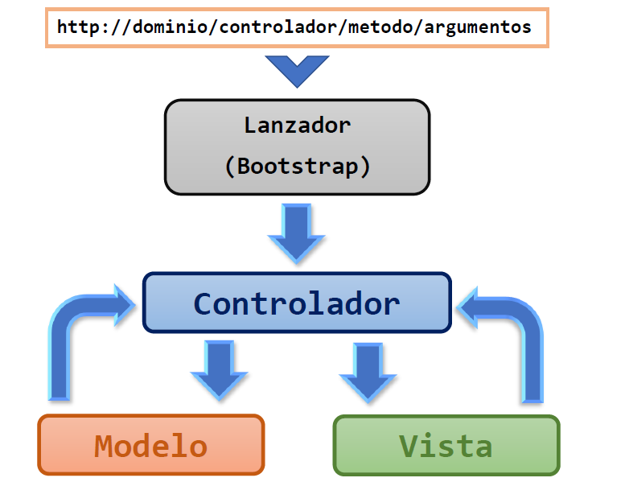

# Framework-PHP
Este repositorio muestra cómo hacer un framework basados en el patrón MVC (Model - View - Controller).  Vamos a ir paso a paso en la creación del framework.

La mayoría de los framework se basan en el patrón MVC, porque permiten extraer cada una de las funcionalidades de la aplicación, permitiendo tener un desarrollo y mantenimiento más ágil.

El Patrón MVC pretende separar todo el código de la aplicación en tres partes:
- Modelo
- Vista
- Controlador 

1. La capa del **Modelo** es dónde va la lógica del negocio, es donde se gestiona el acceso a datos (CRUD).

2. La **Vista** se encarga de renderizar los datos que son traídos desde el modelo. La vista es quien interactúa con el usuario. Aquí va el formato, los estilos y los archivos de javascript. La vista no puede accesar al modelo, ni el modelo a la vista. Para eso existe un mediador que es el Controlador.

3. El **Controlador** es quien se encarga del flujo de la aplicación. Busca en determinado modelo los datos y se los pasa a la vista quien va a renderizar esos datos.
El Controlador es quien responde a las peticiones del usuario hechos desde la vista. Los parámetros son filtrados en el controlador para luego pasarlos al modelo y poder solicitar datos. 

La forma en que el controlador sabe qué información mostrar es de acuerdo a la _url_, donde se pasa el _**controlador/metodo/argumentos**_. Basados en eso, el controlador sabe que datos llamar y mostrar.

La estructura para éste framework será la siguiente: 

	Framework-PHP/
	├── application/
	│	├── Bootstrap.php 
	│	├── Config.php
	│	├── Controller.php 
	│	├── Model.php 
	│	├── Registro.php
	│	├── Request.php
	│	└── View.php
	├── controllers/
	├── libs/
	├── models/
	├── public/
	│	├── css/
	│	├── img/
	│	└── js/
	├── views/
	│	└── layout/
	│		└── default/
	│			├── css/
	│			├── img/
	│			├── js/
	│			├── footer.php 
	│			└── header.php
	├── .htaccess
	└── index.php